# LR1
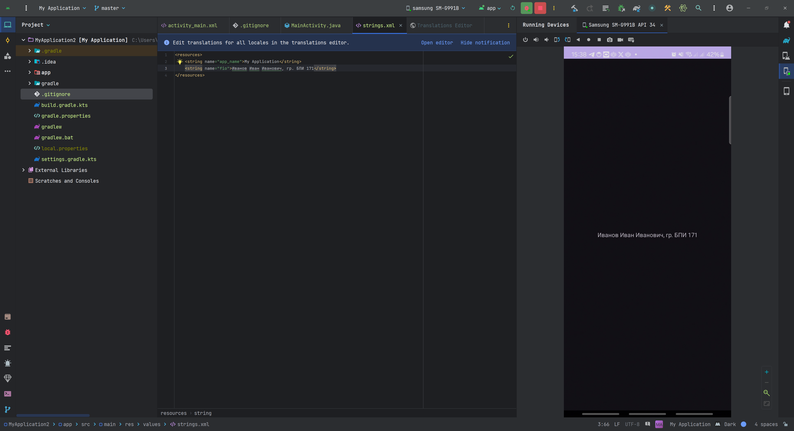
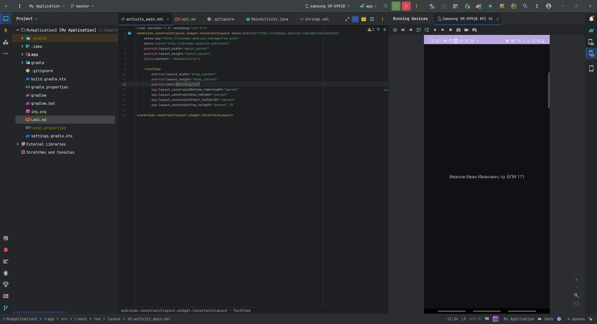
# LR2

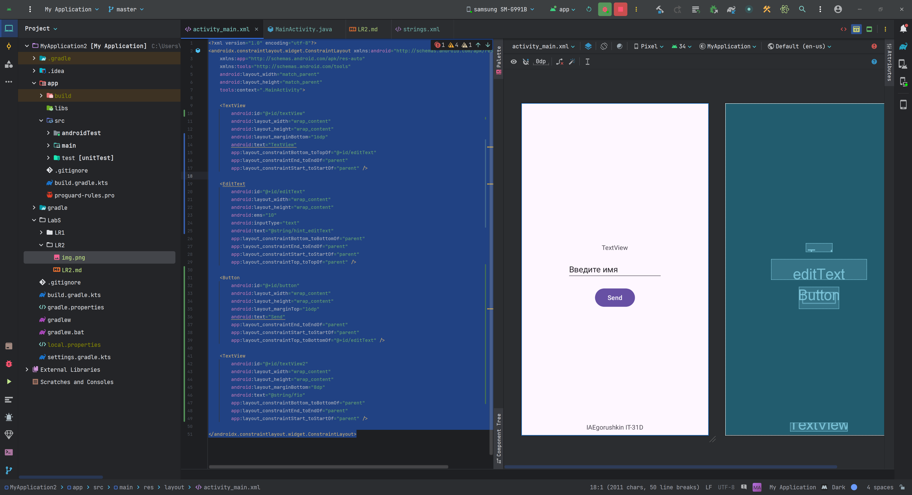
# LR3
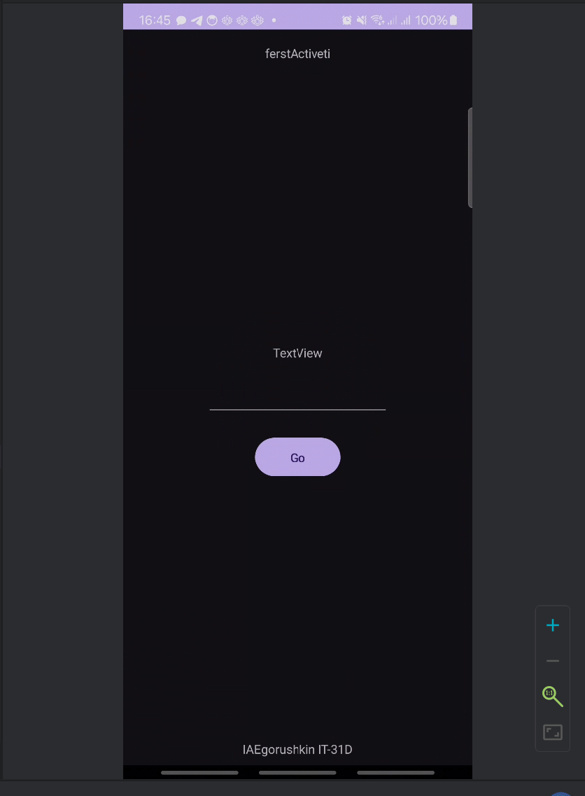
```java
public class MainActivity extends AppCompatActivity {
    public static String text2remember = ""; // Для хранения текста из EditText

    @Override
    protected void onCreate(Bundle savedInstanceState) {
        super.onCreate(savedInstanceState);
        setContentView(R.layout.activity_main); // Устанавливаем layout

        // Определяем нужные элементы
        final EditText editText = findViewById(R.id.editText);
        Button button = findViewById(R.id.button);

        // Устанавливаем текст в EditText из статической переменной
        editText.setText(text2remember);

        // Устанавливаем слушатель для кнопки
        button.setOnClickListener(v -> {
            // Сохраняем текст из EditText в статическую переменную
            text2remember = editText.getText().toString();

            // Создаем Intent и открываем SecondActivity
            Intent intent = new Intent(MainActivity.this, SecondActivity.class);
            startActivity(intent);
        });
    }
}


public class SecondActivity extends AppCompatActivity {
    @SuppressLint("SetTextI18n")
    @Override
    protected void onCreate(Bundle savedInstanceState) {
        super.onCreate(savedInstanceState);
        setContentView(R.layout.activity_second); // Устанавливаем layout

        // Определяем элементы, в данном случае TextView и кнопку
        @SuppressLint({"MissingInflatedId", "LocalSuppress"}) TextView textView = findViewById(R.id.textView6);
        textView.setText("Вы ввели:" + MainActivity.text2remember); // Устанавливаем текст из переменной MainActivity.text2remember

        @SuppressLint({"MissingInflatedId", "LocalSuppress"}) Button button = findViewById(R.id.button2);

        // Устанавливаем слушатель для кнопки для возврата в MainActivity
        button.setOnClickListener(v -> {
            Intent intent = new Intent(SecondActivity.this, MainActivity.class);
            startActivity(intent);
        });
    }
}
```
# LR4


# LR5
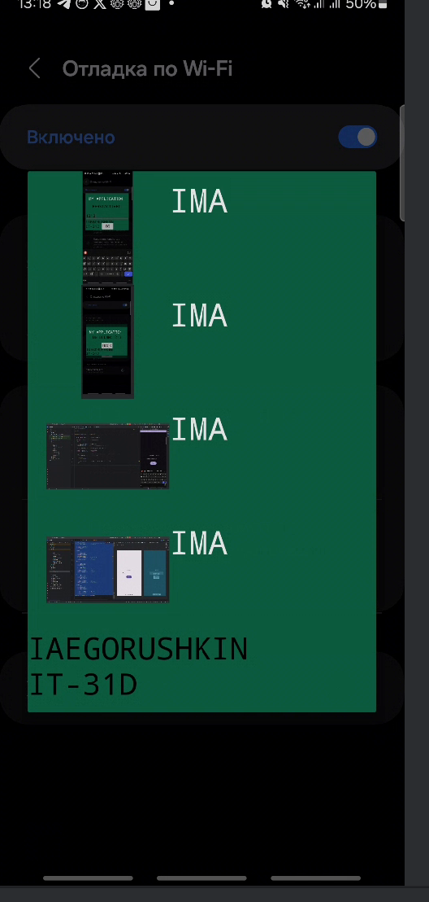
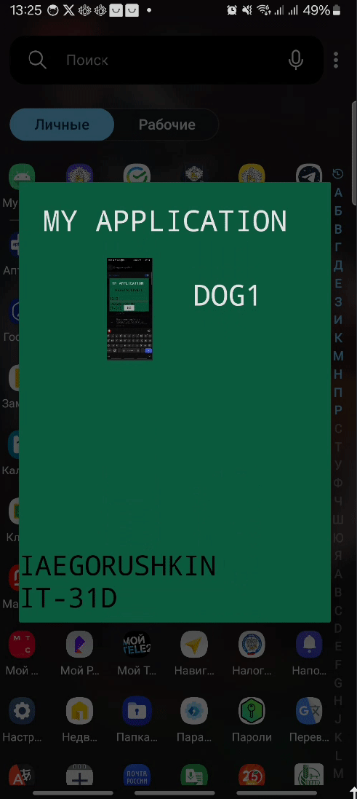

# LR6
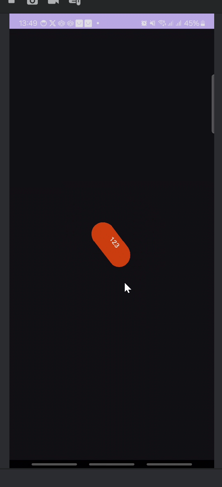
# LR7
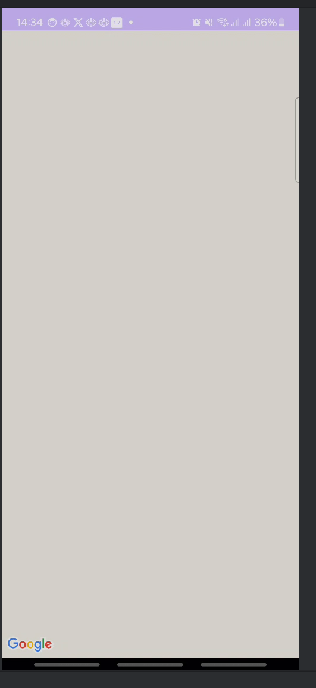

# 8 


# 9 
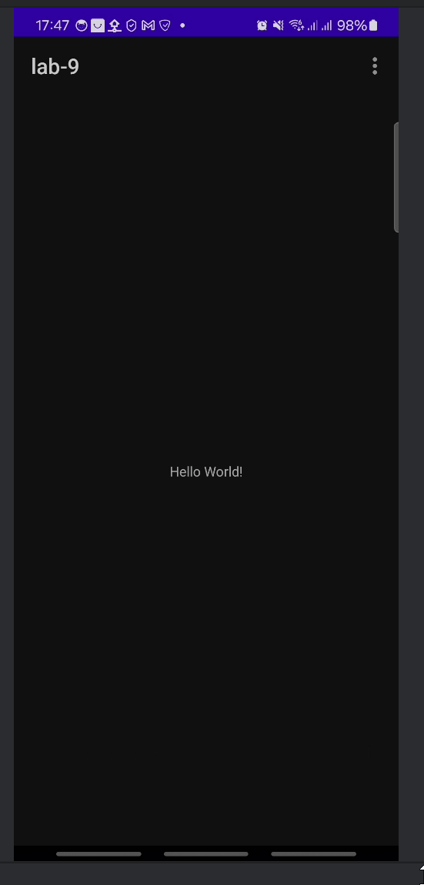

# 10 

# 11

# 12
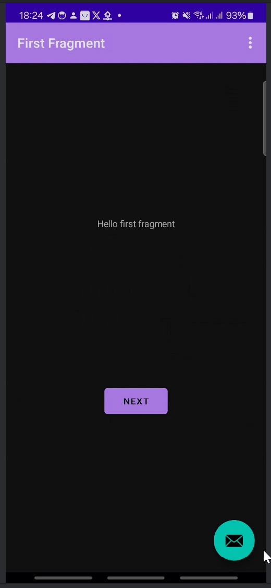
# 13
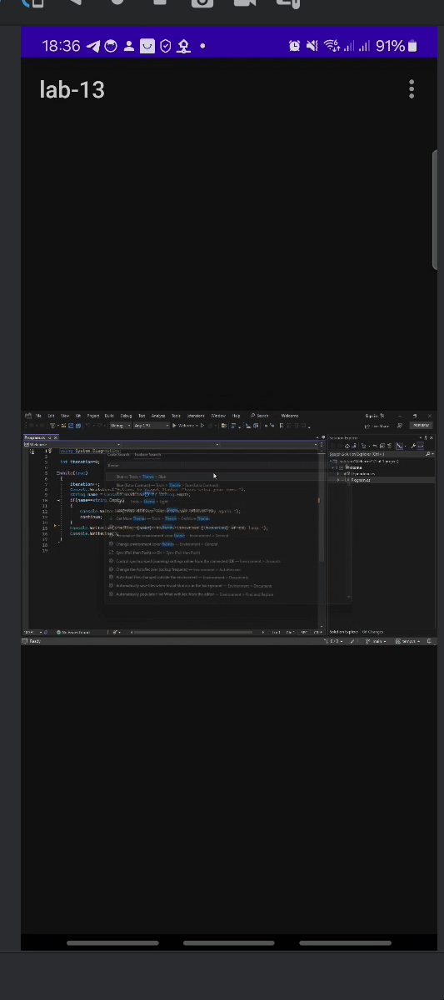
# 14
